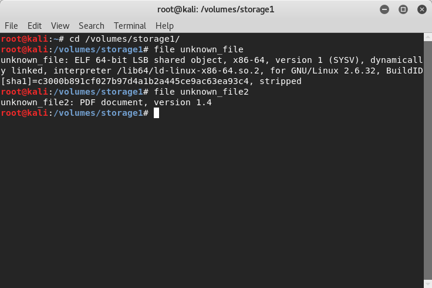
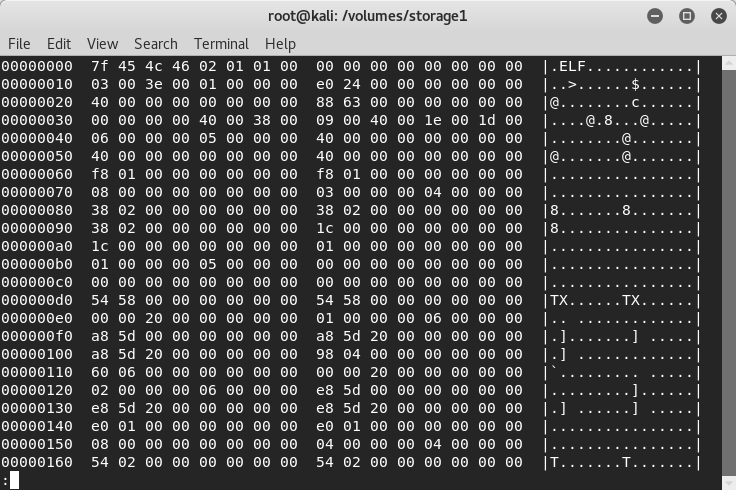
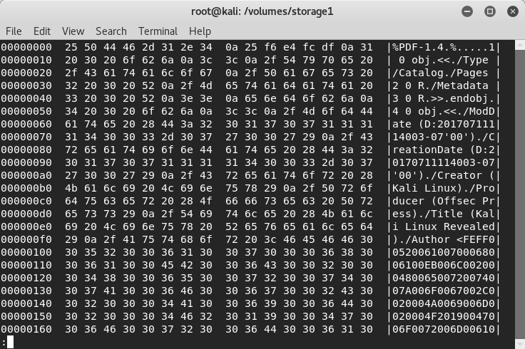
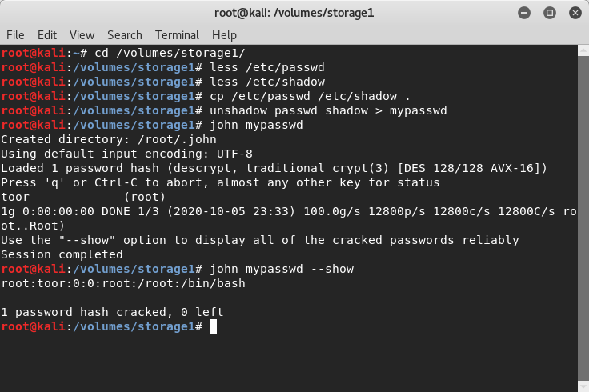
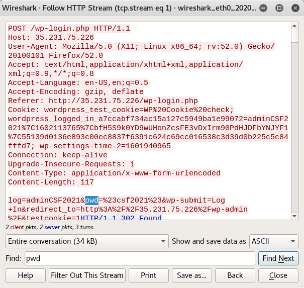

# First Regular Laboratory

### Exploring Unknown Artifacts:

- Finding out Artifacts Type `ELF` & `PDF`

- Running `hexdump -C <FILE> | less`

---

### Auditing Passwords:

- Finding out Root Password `toor`

---

### Network Analysis:

- Finding out Login Credentials `log=_&pwd=_`
